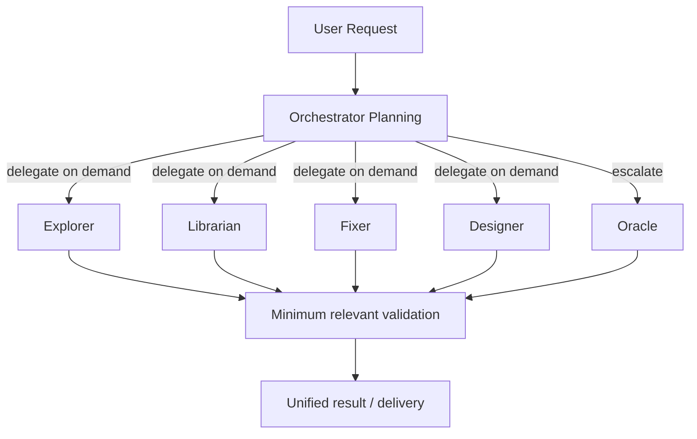

# OpenCode Preset

[中文](./README_zh.md)


> An OpenCode multi-Agent orchestration preset for complex software engineering tasks.

This preset assigns code retrieval, implementation, external research, design, and review to different roles through clear responsibility boundaries, parallel delegation, verification workflows, and MCP tools—preventing the main Agent from handling everything alone and exhausting context too quickly.

> [!IMPORTANT]
> This is a personal-preference configuration preset, not a universal out-of-the-box release. Default models, providers, and optional tools need to be adjusted for your environment.

> [!WARNING]
> **Current version: v0.1.0 (early stage)**. Configuration interfaces, Agent model assignments, and the Skills list may continue to change.

---

## Table of Contents

- [OpenCode Preset](#opencode-preset)
  - [Table of Contents](#table-of-contents)
  - [Version Status](#version-status)
  - [Features](#features)
  - [Recommended Usage](#recommended-usage)
  - [Orchestration Flow](#orchestration-flow)
  - [Prerequisites](#prerequisites)
    - [Required](#required)
    - [Optional](#optional)
  - [Quick Start](#quick-start)
    - [Project-level Usage](#project-level-usage)
    - [Global Usage](#global-usage)
    - [Install `/context` Optional Dependency](#install-context-optional-dependency)
  - [Agent Roles](#agent-roles)
  - [Configuration Structure](#configuration-structure)
  - [AGENTS.md Routing Principles](#agentsmd-routing-principles)
  - [Plugins](#plugins)
  - [Skills](#skills)
  - [Customization Suggestions](#customization-suggestions)
  - [Known Limitations](#known-limitations)
  - [More Documentation](#more-documentation)
  - [Third-Party Projects and Licenses](#third-party-projects-and-licenses)
  - [License](#license)

---

## Version Status

This preset is currently at **v0.1.0** and in early iteration. The following may still change:

- Configuration file fields and default values;
- Agent model assignments and the Skills list;
- Integration methods for some optional MCPs and plugins.

This repository keeps some `@latest` dependency references to quickly follow upstream; if you need a reproducible environment, replace `@latest` with a verified fixed version before release.

## Features

- **Clear responsibilities**: Orchestrator handles planning, scheduling, coordination, and acceptance; specialized work is delegated to the corresponding Agent.
- **Parallel execution**: Retrieval, research, implementation, and visual-analysis tasks that do not depend on each other can run in parallel.
- **Verification-first**: Choose tests, type checks, builds, or smoke validation based on the scope of change; do not take an Agent's completion claim at face value.
- **Context control**: Reduce main-session context inflation through delegation, CodeGraph, and the `/context` tool.
- **Safety boundaries**: Shared-state writes, Git operations, and destructive commands require stricter confirmation and protection.
- **Extensibility**: Includes Skills for frontend engineering, Office documents, product discovery, image generation, and release validation.

## Recommended Usage

> [!TIP]
> We recommend using OpenCode through [OpenChamber](https://github.com/openchamber/openchamber).


## Orchestration Flow

The diagram below shows only a **possible** orchestration pattern. The Orchestrator will invoke only the Agents relevant to the actual task and will not run the full pipeline every time.



## Prerequisites

### Required

- [OpenCode](https://opencode.ai/)
- An OpenCode version supported by [oh-my-opencode-slim](https://github.com/alvinunreal/oh-my-opencode-slim)
- An available model provider

The default configuration uses models under `opencode-go`, `kimi-for-coding`, and `zhipuai`. Please confirm these providers are available in your environment before use, or edit [`.opencode/oh-my-opencode-slim.json`](./.opencode/oh-my-opencode-slim.json) to replace the models.

### Optional

| Component | Purpose | Impact when not installed |
|---|---|---|
| [CodeGraph](https://github.com/colbymchenry/codegraph) | Symbol, call-chain, dependency, and impact-scope queries | `codegraph` MCP unavailable |
| [OfficeCLI](https://github.com/iOfficeAI/OfficeCLI) | Create, read, and modify Office documents | Office MCP and related Skills unavailable |
| [Destructive Command Guard](https://github.com/Dicklesworthstone/destructive_command_guard) | Intercept high-risk Shell commands | `dcg-guard` automatically remains disabled |
| npm | Install tokenizer dependencies for `/context` | `/context` cannot provide exact token counts |

`websearch`, `context7`, and `gh_grep` are provided by oh-my-opencode-slim and its runtime environment, not by local MCPs defined in this repository's `opencode.json`.

## Quick Start

### Project-level Usage

After cloning, place the following in the target project root:

```text
your-project/
├── AGENTS.md
├── opencode.json
└── .opencode/
```

> [!WARNING]
> If the target project already has a configuration with the same name, manually merge it first; do not overwrite directly.

### Global Usage

OpenCode's global configuration directory is `~/.config/opencode/`. For global installation, merge the contents of the repository root and `.opencode/` into that directory instead of nesting the entire repository:

```text
~/.config/opencode/
├── AGENTS.md
├── opencode.json
├── oh-my-opencode-slim.json
├── tui.json
├── command/
├── plugins/
└── skills/
```

> [!CAUTION]
> Do not copy the entire repository as `~/.config/opencode/.opencode/`, or you will create an extra directory level.

We recommend trying the preset in a single project and completing model replacement before merging it into the global configuration. Detailed steps are in the [Installation Guide](./docs/installation.md).

### Install `/context` Optional Dependency

Run in the repository root:

```sh
./.opencode/plugins/install.sh
```

Dependencies are installed into `.opencode/plugins/vendor/`, which is ignored by Git, so they will not pollute the project root.

> [!NOTE]
> After modifying OpenCode configuration, Agents, Skills, Commands, or Plugins, you must exit and restart OpenCode for the changes to take effect.

## Agent Roles

| Agent | Primary Responsibility | Default Model |
|---|---|---|
| Orchestrator | Planning, scheduling, coordination, acceptance | `kimi-for-coding/k3` |
| Designer | UI/UX, responsive layout, visual and interaction polishing | `opencode-go/kimi-k2.7-code` |
| Explorer | Fast codebase retrieval and impact-scope reconnaissance | `opencode-go/deepseek-v4-flash` |
| Fixer | Mechanical implementation and fixes with clear boundaries | `opencode-go/kimi-k2.7-code` |
| Librarian | External documentation, API, and GitHub research | `opencode-go/deepseek-v4-flash` |
| Observer | Analysis of images, screenshots, PDFs, and charts | `zhipuai/glm-4.6v` |
| Oracle | High-risk architecture decisions, complex debugging, and review | `opencode-go/qwen3.7-max` |
| Fast-Generic | Mechanical commands such as Git, Lint, Typecheck, tests, and builds | `opencode-go/deepseek-v4-flash` |

Council uses `opencode-go/qwen3.7-max` for synthesis and adopts the internal member preset `default`:

| Seat | Model | Focus |
|---|---|---|
| alpha | `opencode-go/glm-5.2` | Architecture, correctness, system integration |
| beta | `opencode-go/kimi-k2.7-code` | Implementation quality, details, edge cases |
| gamma | `opencode-go/kimi-k2.6` | Performance, resources, real-world tradeoffs |

Here `default` is the **Council member preset**; the currently enabled oh-my-opencode-slim overall preset is `me`.

For the full division of labor and Skills configuration, see [Agent Configuration](./docs/agents.md).

## Configuration Structure

```text
.
├── AGENTS.md                         # Orchestrator workflows and approval rules
├── opencode.json                     # OpenCode plugins, built-in Agents, and MCP configuration
├── .opencode/
│   ├── oh-my-opencode-slim.json      # Agent, model, Skills, and Council configuration
│   ├── tui.json                      # TUI configuration
│   ├── command/                      # Custom commands
│   ├── plugins/                      # Local plugins
│   └── skills/                       # Skills distributed with this repository
├── docs/                             # Installation and configuration docs
└── img/                              # README images
```

OpenCode's built-in `explore` and `general` Agents are disabled and replaced by this preset's Explorer and specialist Agents.

## AGENTS.md Routing Principles

`AGENTS.md` is used to constrain the Orchestrator and prevent it from bypassing the delegation flow and doing all the work itself. The core routing is as follows:

| Task | Agent | Note |
|---|---|---|
| External projects, library docs, APIs, and time-sensitive facts | `@librarian` | Do not answer potentially changing information from model memory |
| Open-ended codebase search, call-chain, and impact-scope analysis | `@explorer` | Read directly when the path is known |
| Image, screenshot, PDF, and chart analysis | `@observer` | Isolate multimedia content and return structured observations |
| Office document content, data, and structured editing | `@fixer` | Data, content, and mechanical edits |
| Presentation visual design, layout, and animation polishing | `@designer` | Preserve visual hierarchy, layout, and interaction intent |
| UI/UX, responsive layout, and visual polishing | `@designer` | Self-handle for <10 line style tweaks in a single file |
| Multi-file mechanical implementation or single-file changes expected to exceed 20 lines | `@fixer` | Clarify files, approach, and acceptance criteria before delegating |
| High-risk architecture decisions, complex technical tradeoffs, and review | `@oracle` | Escalate only when the cost of error is high |

It also defines parallel execution, approval boundaries, coding practices, verification requirements, communication style, task wrap-up, and exception handling.

## Plugins

| Plugin | Purpose |
|---|---|
| `context-usage.ts` | Provides the `context_usage` tool to count Token usage by role and message source |
| `tokenizer-registry.mjs` | Selects tiktoken, Transformers, or approximate counting based on provider and model |
| `dcg-guard.js` | Calls the optional `dcg` before Bash execution to intercept high-risk commands |

`dcg-guard` automatically sets `DCG_ROBOT=1` when calling `dcg`. If `dcg` is not found on the system, the plugin will not register an interception hook.

## Skills

The repository includes Skills for orchestration and verification, frontend engineering, Office documents, design and product, and build tools. For the full list and their purposes, see [Skills Guide](./docs/skills.md).

## Customization Suggestions

1. Replace unavailable or budget-unfriendly models in `.opencode/oh-my-opencode-slim.json`.
2. Remove unneeded Skills to reduce configuration size and trigger noise.
3. If you do not use Office capabilities, disable the `officecli` MCP and remove related Skills.
4. If you do not use CodeGraph, disable the corresponding MCP; projects that need a code graph must initialize the index themselves.
5. If reproducibility matters, change `@latest` to a verified fixed version.

## Known Limitations

- Default models and providers reflect strong personal preferences and are not guaranteed to be available for all accounts.
- `@latest` will automatically pull new plugin versions, which may introduce behavior changes not yet validated by this repository.
- CodeGraph, OfficeCLI, DCG, and tokenizer dependencies need to be installed separately.
- Some Skills and templates come from third-party projects; preserve their original licenses and attribution before redistributing.

## More Documentation

- [Installation Guide](./docs/installation.md)
- [Workflow Examples](./docs/workflows.md)
- [FAQ](./docs/faq.md)
- [Security Notice](./SECURITY.md)
- [Contributing Guide](./CONTRIBUTING.md)
- [Changelog](./CHANGELOG.md)
- [Third-Party Notices](./THIRD_PARTY_NOTICES.md)

## Third-Party Projects and Licenses

This preset is based on or integrates the following projects:

- [OpenCode](https://opencode.ai/)
- [oh-my-opencode-slim](https://github.com/alvinunreal/oh-my-opencode-slim), by [alvinunreal](https://github.com/alvinunreal)
- [opencode-notifier](https://github.com/mohak34/opencode-notifier), by [mohak34](https://github.com/mohak34)
- [CodeGraph](https://github.com/colbymchenry/codegraph), by [colbymchenry](https://github.com/colbymchenry)
- [OfficeCLI](https://github.com/iOfficeAI/OfficeCLI), by [iOfficeAI](https://github.com/iOfficeAI)
- [Destructive Command Guard](https://github.com/Dicklesworthstone/destructive_command_guard), by [Dicklesworthstone](https://github.com/Dicklesworthstone)

Third-party Skills and templates distributed with this repository retain their respective licenses and attribution. Identified sources are listed in [`THIRD_PARTY_NOTICES.md`](./THIRD_PARTY_NOTICES.md). Do not assume that the root-directory license covers all third-party content until source and license verification is complete.

## License

Original configuration, scripts, and documentation in this repository are licensed under the [MIT License](./LICENSE). Third-party Skills, templates, and other components remain subject to their respective licenses; see [`THIRD_PARTY_NOTICES.md`](./THIRD_PARTY_NOTICES.md) for details.
