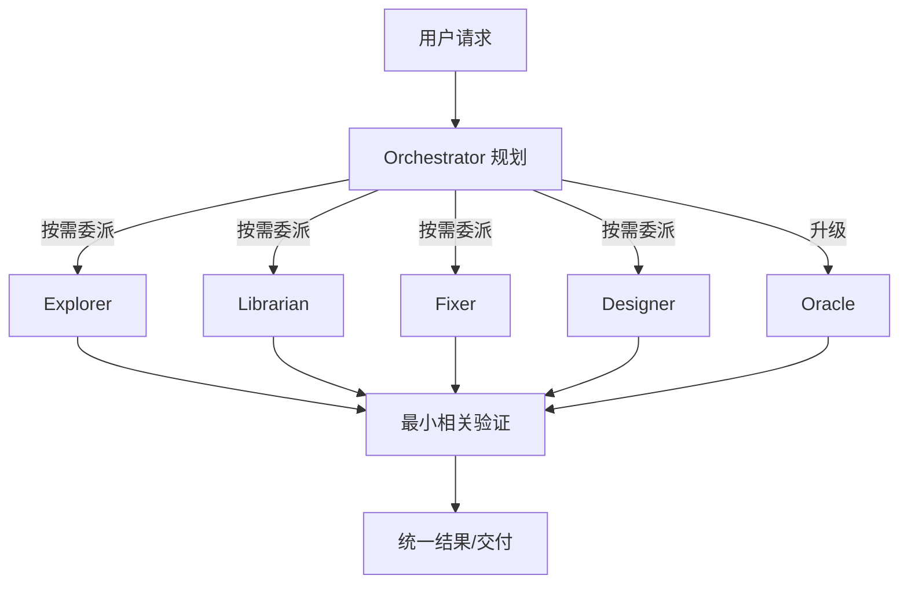

# OpenCode Preset

[English](./README.md)


> 面向复杂软件工程任务的 OpenCode 多 Agent 编排预设。

本预设通过划分职责边界、并行委派、验证流程和 MCP 工具，把代码检索、实现、外部研究、设计与审查分配给不同角色，避免主 Agent 独自处理全部工作并迅速消耗上下文。

> [!IMPORTANT]
> 这是一份带有个人偏好的配置预设，不是开箱即用的通用发行版。默认模型、Provider 和可选工具需要按你的环境调整。

> [!WARNING]
> **当前版本：v0.1.0（早期版本）**。配置接口、Agent 模型分配和 Skills 清单可能继续调整。

---

## 目录

- [OpenCode Preset](#opencode-preset)
  - [目录](#目录)
  - [版本状态](#版本状态)
  - [特性](#特性)
  - [推荐用法](#推荐用法)
  - [编排流程](#编排流程)
  - [前置要求](#前置要求)
    - [必需](#必需)
    - [可选](#可选)
  - [快速开始](#快速开始)
    - [项目级使用](#项目级使用)
    - [全局使用](#全局使用)
    - [安装 `/context` 可选依赖](#安装-context-可选依赖)
  - [Agent 分工](#agent-分工)
  - [配置结构](#配置结构)
  - [AGENTS.md 路由原则](#agentsmd-路由原则)
  - [Plugins](#plugins)
  - [Skills](#skills)
  - [自定义建议](#自定义建议)
  - [已知限制](#已知限制)
  - [更多文档](#更多文档)
  - [第三方项目与许可](#第三方项目与许可)
  - [License](#license)

---

## 版本状态

本预设当前版本为 **v0.1.0**，处于早期迭代阶段。以下内容仍可能调整：

- 配置文件的字段与默认值；
- Agent 的模型分配和 Skills 列表；
- 部分可选 MCP 与插件的接入方式。

本仓库保留了部分 `@latest` 依赖引用，便于快速跟进上游；如果你需要可复现环境，建议在发布前将 `@latest` 替换为已验证的固定版本。

## 特性

- **职责明确**：Orchestrator 负责规划、调度、协调和验收，专业工作交给对应 Agent。
- **并行执行**：互不依赖的检索、研究、实现和视觉分析任务可以并行开展。
- **验证优先**：根据变更范围选择测试、类型检查、构建或冒烟验证，不直接采信 Agent 的完成声明。
- **上下文控制**：通过委派、CodeGraph 和 `/context` 工具减少主会话上下文膨胀。
- **安全边界**：共享状态写入、Git 操作和破坏性命令需要更严格的确认与防护。
- **扩展能力**：包含前端工程、Office 文档、产品发现、图像生成和发布验证等 Skills。

## 推荐用法

> [!TIP]
> 推荐通过 [OpenChamber](https://github.com/openchamber/openchamber) 使用 OpenCode。


## 编排流程

以下只是**可能**的编排示意，Orchestrator 会按实际任务只调用相关 Agent，不会每次走完整流水线。



## 前置要求

### 必需

- [OpenCode](https://opencode.ai/)
- [oh-my-opencode-slim](https://github.com/alvinunreal/oh-my-opencode-slim) 支持的 OpenCode 版本
- 可用的模型 Provider

默认配置使用 `opencode-go`、`kimi-for-coding` 和 `zhipuai` 下的模型。使用前请确认这些 Provider 在你的环境中可用，或编辑 [`.opencode/oh-my-opencode-slim.json`](./.opencode/oh-my-opencode-slim.json) 替换模型。

### 可选

| 组件 | 用途 | 未安装时的影响 |
|---|---|---|
| [CodeGraph](https://github.com/colbymchenry/codegraph) | 符号、调用链、依赖和影响范围查询 | `codegraph` MCP 不可用 |
| [OfficeCLI](https://github.com/iOfficeAI/OfficeCLI) | 创建、读取和修改 Office 文档 | Office MCP 和相关 Skills 不可用 |
| [Destructive Command Guard](https://github.com/Dicklesworthstone/destructive_command_guard) | 拦截高风险 Shell 命令 | `dcg-guard` 自动保持禁用 |
| npm | 安装 `/context` 的 tokenizer 依赖 | `/context` 无法进行精确 Token 统计 |

`websearch`、`context7` 和 `gh_grep` 由 oh-my-opencode-slim 及其运行环境提供，不是在本仓库的 `opencode.json` 中定义的本地 MCP。

## 快速开始

### 项目级使用

克隆仓库后，将以下内容放在目标项目根目录：

```text
your-project/
├── AGENTS.md
├── opencode.json
└── .opencode/
```

> [!WARNING]
> 如果目标项目已有同名配置，请先手动合并，不要直接覆盖。

### 全局使用

OpenCode 的全局配置目录是 `~/.config/opencode/`。全局安装时需要将仓库根目录和 `.opencode/` 中的内容合并到该目录，而不是把整个仓库原样嵌套进去：

```text
~/.config/opencode/
├── AGENTS.md
├── opencode.json
├── oh-my-opencode-slim.json
├── tui.json
├── command/
├── plugins/
└── skills/
```

> [!CAUTION]
> 不要把整个仓库复制成 `~/.config/opencode/.opencode/`，否则会产生多余的目录层级。

建议先在单个项目中试用并完成模型替换，再合并到全局配置。详细步骤见 [安装指南](./docs/installation.md)。

### 安装 `/context` 可选依赖

在本仓库根目录运行：

```sh
./.opencode/plugins/install.sh
```

依赖会安装到被 Git 忽略的 `.opencode/plugins/vendor/` 中，不会污染项目根目录。

> [!NOTE]
> 修改 OpenCode 配置、Agent、Skill、Command 或 Plugin 后，需要退出并重新启动 OpenCode 才会生效。

## Agent 分工

| Agent | 主要职责 | 默认模型 |
|---|---|---|
| Orchestrator | 规划、调度、协调、验收 | `kimi-for-coding/k3` |
| Designer | UI/UX、响应式布局、视觉和交互打磨 | `opencode-go/kimi-k2.7-code` |
| Explorer | 快速代码库检索和影响范围侦察 | `opencode-go/deepseek-v4-flash` |
| Fixer | 边界清晰的机械实现和修复 | `opencode-go/kimi-k2.7-code` |
| Librarian | 外部文档、API 和 GitHub 调研 | `opencode-go/deepseek-v4-flash` |
| Observer | 图片、截图、PDF 和图表分析 | `zhipuai/glm-4.6v` |
| Oracle | 高风险架构决策、复杂调试和审查 | `opencode-go/qwen3.7-max` |
| Fast-Generic | Git、Lint、Typecheck、测试和构建等机械命令 | `opencode-go/deepseek-v4-flash` |

Council 使用 `opencode-go/qwen3.7-max` 进行综合，并采用内部成员预设 `default`：

| 席位 | 模型 | 关注点 |
|---|---|---|
| alpha | `opencode-go/glm-5.2` | 架构、正确性、系统集成 |
| beta | `opencode-go/kimi-k2.7-code` | 实现质量、细节、边界情况 |
| gamma | `opencode-go/kimi-k2.6` | 性能、资源、现实权衡 |

这里的 `default` 是 **Council 成员预设**；当前启用的 oh-my-opencode-slim 整体预设是 `me`。

完整分工和 Skills 配置见 [Agent 配置说明](./docs/agents.md)。

## 配置结构

```text
.
├── AGENTS.md                         # Orchestrator 工作流和审批规则
├── opencode.json                     # OpenCode 插件、内置 Agent 和 MCP 配置
├── .opencode/
│   ├── oh-my-opencode-slim.json      # Agent、模型、Skills 和 Council 配置
│   ├── tui.json                      # TUI 配置
│   ├── command/                      # 自定义命令
│   ├── plugins/                      # 本地插件
│   └── skills/                       # 随仓库分发的 Skills
├── docs/                             # 安装和配置文档
└── img/                              # README 图片
```

OpenCode 自带的 `explore` 和 `general` Agent 已关闭，由本预设中的 Explorer 和专业 Agent 取代。

## AGENTS.md 路由原则

`AGENTS.md` 用于约束 Orchestrator，防止其绕过委派流程并自行执行全部工作。核心路由如下：

| 任务 | Agent | 说明 |
|---|---|---|
| 外部项目、库文档、API 和时效性事实调研 | `@librarian` | 不依赖模型记忆回答可能变化的信息 |
| 范围不明确的代码库检索、调用链与影响范围分析 | `@explorer` | 已知路径时可直接读取 |
| 图片、截图、PDF 和图表分析 | `@observer` | 隔离多媒体内容，返回结构化观察 |
| Office 文档内容、数据和结构化编辑 | `@fixer` | 数据、内容和机械编辑 |
| 演示文稿视觉设计、版式与动画打磨 | `@designer` | 保留视觉层级、布局和交互意图 |
| UI/UX、响应式布局和视觉打磨 | `@designer` | 单文件 <10 行样式微调可自行处理 |
| 多文件机械实现或单文件预计改动 >20 行 | `@fixer` | 委派前明确文件、改法和验收结果 |
| 高风险架构决策、复杂技术权衡和审查 | `@oracle` | 仅在错误成本较高时升级使用 |

此外还定义了并行执行、审批边界、编码习惯、验证要求、沟通方式、任务收尾和异常处理流程。

## Plugins

| Plugin | 用途 |
|---|---|
| `context-usage.ts` | 提供 `context_usage` 工具，按角色和消息来源统计 Token 用量 |
| `tokenizer-registry.mjs` | 根据 Provider 和模型选择 tiktoken、Transformers 或近似计数 |
| `dcg-guard.js` | 在 Bash 执行前调用可选的 `dcg`，拦截高风险命令 |

`dcg-guard` 会在调用 `dcg` 时自动设置 `DCG_ROBOT=1`。系统中找不到 `dcg` 时，插件不会注册拦截 Hook。

## Skills

仓库包含编排与验证、前端工程、Office 文档、设计与产品、构建工具等多类 Skills。完整清单和用途见 [Skills 说明](./docs/skills.md)。

## 自定义建议

1. 在 `.opencode/oh-my-opencode-slim.json` 中替换不可用或不符合预算的模型。
2. 删除不需要的 Skills，减少配置体积和触发噪声。
3. 不使用 Office 能力时，可关闭 `officecli` MCP 并移除相关 Skills。
4. 不使用 CodeGraph 时，可关闭对应 MCP；需要代码图谱的项目需自行初始化索引。
5. 如果重视可复现性，将 `@latest` 改为经过验证的固定版本。

## 已知限制

- 默认模型和 Provider 具有明显的个人偏好，不保证对所有账户可用。
- `@latest` 会自动获取插件新版本，但可能引入未经本仓库验证的行为变化。
- CodeGraph、OfficeCLI、DCG 和 tokenizer 依赖需要单独安装。
- 部分 Skills 和模板来自第三方项目，继续分发前应保留其原始许可证与署名。

## 更多文档

- [安装指南](./docs/installation.md)
- [工作流示例](./docs/workflows.md)
- [FAQ](./docs/faq.md)
- [安全说明](./SECURITY.md)
- [贡献指南](./CONTRIBUTING.md)
- [更新日志](./CHANGELOG.md)
- [第三方声明](./THIRD_PARTY_NOTICES.md)

## 第三方项目与许可

本预设基于或集成以下项目：

- [OpenCode](https://opencode.ai/)
- [oh-my-opencode-slim](https://github.com/alvinunreal/oh-my-opencode-slim)，作者 [alvinunreal](https://github.com/alvinunreal)
- [opencode-notifier](https://github.com/mohak34/opencode-notifier)，作者 [mohak34](https://github.com/mohak34)
- [CodeGraph](https://github.com/colbymchenry/codegraph)，作者 [colbymchenry](https://github.com/colbymchenry)
- [OfficeCLI](https://github.com/iOfficeAI/OfficeCLI)，作者 [iOfficeAI](https://github.com/iOfficeAI)
- [Destructive Command Guard](https://github.com/Dicklesworthstone/destructive_command_guard)，作者 [Dicklesworthstone](https://github.com/Dicklesworthstone)

随仓库分发的第三方 Skills 和模板保留其各自的许可证与署名。已识别来源见 [`THIRD_PARTY_NOTICES.md`](./THIRD_PARTY_NOTICES.md)。在完成来源与许可证核对前，不应假定根目录许可证覆盖所有第三方内容。

## License

本仓库原创的配置、脚本和文档采用 [MIT License](./LICENSE)。第三方 Skills、模板和其他组件仍受其各自许可证约束；详见 [`THIRD_PARTY_NOTICES.md`](./THIRD_PARTY_NOTICES.md)。
