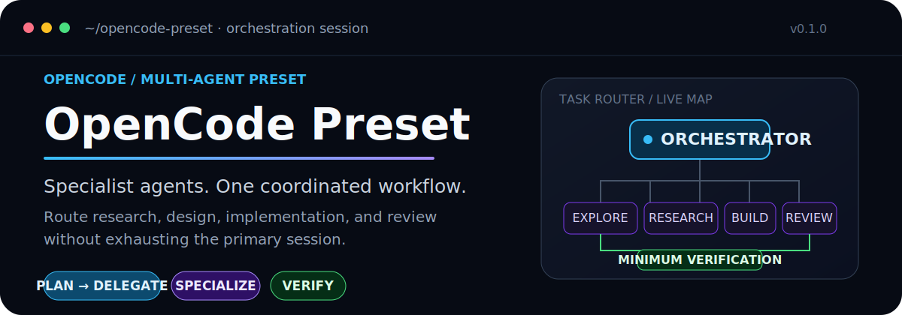
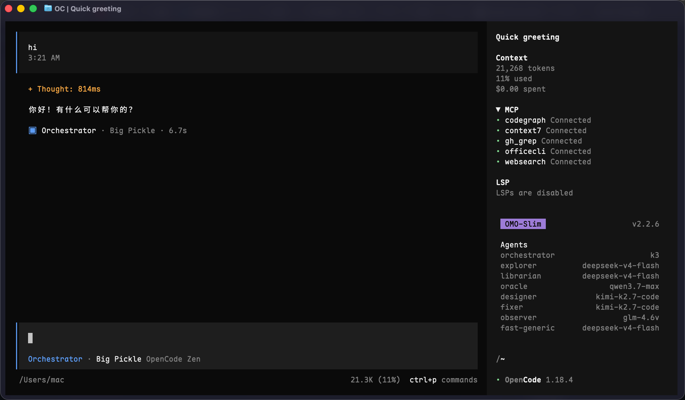
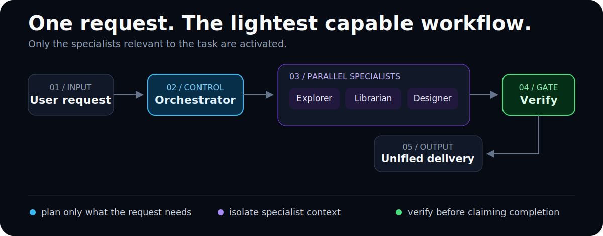
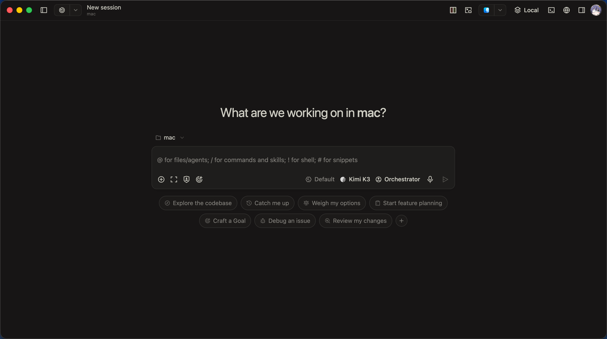

<p align="center">
  
</p>

<p align="center">
  <strong>面向 OpenCode 的多 Agent 编排预设。</strong><br>
  让主会话保持专注，由专业 Agent 分别处理代码检索、外部调研、设计、实现、媒体分析和高风险审查。
</p>

<p align="center">
  <a href="./README.md">English</a> ·
  <a href="#快速开始">快速开始</a> ·
  <a href="./docs/installation.md">安装指南</a> ·
  <a href="./docs/workflows.md">工作流</a> ·
  <a href="./docs/faq.md">FAQ</a>
</p>

> [!WARNING]
> **v0.1.0 仍处于早期阶段。** 模型、Provider、可选工具和配置字段体现的是个人使用偏好，在更广泛使用前应根据自己的环境进行调整。

## 查看预设的实际运行效果

<p align="center">
  
</p>

上图展示的是这套配置在 OpenCode 中的实际运行状态：由一个 **Orchestrator** 负责主对话、委派边界清晰的工作，并只在完成相关验证后验收结果。

## 为什么需要这套预设

即使通用 Agent 足够强大，在长时间的软件工程任务中仍可能成为瓶颈。代码搜索结果、库文档、截图、实现细节和测试输出会争夺同一个上下文；同一个模型还要同时做到快速、富有创意、精确并保持质疑。

OpenCode Preset 将这些职责拆开：

- **保护主会话上下文**：把专业 Agent 的完整执行压缩成聚焦的结果。
- **按职责路由**：不再让一个模型包办所有工作。
- **并行处理独立任务**：例如同时进行代码检索和外部资料调研。
- **按影响选择验证**：使用能够证明目标行为的最小相关检查。
- **有目的地升级**：当架构、安全或数据完整性让错误代价变高时，再交给高级审查能力。

## 工作如何流转

<p align="center">
  
</p>

这是一种路由模型，而不是固定流水线。已知路径的小改动可以直接处理；跨领域任务则可以启动多个相互独立的执行通道。Orchestrator 会选择能够提供可信证据的最轻工作流。

## 专业 Agent 阵容

| Agent | 负责内容 | 典型交付 |
|---|---|---|
| **Orchestrator** | 规划、调度、边界、结果整合和验收 | 将一个请求转化为小型依赖图 |
| **Explorer** | 代码库搜索、符号、调用链和影响范围 | 返回压缩后的仓库证据 |
| **Librarian** | 当前文档、API、GitHub 项目和外部事实 | 返回有来源支撑的调研，而不是依赖模型记忆 |
| **Designer** | UI/UX、响应式行为、演示文稿设计和视觉打磨 | 负责用户可见的布局和交互质量 |
| **Fixer** | 边界明确的实现和结构化 Office 工作 | 根据具体方案完成范围受控的机械修改 |
| **Observer** | 图片、截图、PDF 和图表 | 隔离视觉输入并返回结构化观察结果 |
| **Oracle** | 高风险架构、持续性调试和战略审查 | 在错误选择代价很高时提供升级通道 |
| **Fast-Generic** | Git 侦察、Lint、类型检查、测试和构建 | 在不修改代码的情况下执行常规命令验证 |

当真正需要多模型共识且值得付出调用成本时，Council 模式会增加三个相互独立的技术席位，并执行一次综合分析。

## 仓库包含什么

```text
.
├── AGENTS.md                    # 编排、路由、安全边界和验证规则
├── opencode.json                # OpenCode 插件、MCP 和内置 Agent 覆盖配置
├── .opencode/
│   ├── oh-my-opencode-slim.json # 模型、专业 Skills 和 Council 配置
│   ├── tui.json                 # 终端界面设置
│   ├── command/                 # 自定义命令
│   ├── plugins/                 # /context 和危险命令守卫
│   └── skills/                  # 随仓库分发的专业工作流
├── docs/                        # 安装、Agent、Skills、工作流和 FAQ
└── img/                         # 真实界面截图
```

### 能力层次

| 层次 | 包含的能力 |
|---|---|
| **编排** | 委派规则、审批边界、Council、worktree、深度工作和验证规划 |
| **代码工作** | CodeGraph 辅助检索、Vite、pnpm、Vitest、tsdown、依赖检查和发布冒烟测试 |
| **设计与产品** | Vue/Nuxt 指南、UI 打磨、产品发现、营销心理和图标生成 |
| **文档** | DOCX、XLSX、数据仪表盘、财务模型、学术论文、Pitch Deck 和 Morph 演示文稿 |
| **会话安全** | 上下文用量报告、可选 Tokenizer 支持和危险命令拦截 |

当前完整分配请查看 [Skills 说明](./docs/skills.md)和 [Agent 配置说明](./docs/agents.md)。

## 快速开始

### 1. 先在单个项目中试用

克隆本仓库，然后将以下内容复制或合并到希望由 OpenCode 处理的项目中：

```text
your-project/
├── AGENTS.md
├── opencode.json
└── .opencode/
```

> [!CAUTION]
> 如果目标项目已经存在同名文件，请手动合并。不要直接覆盖已有的 OpenCode 配置。

### 2. 调整模型分配

打开 [`.opencode/oh-my-opencode-slim.json`](./.opencode/oh-my-opencode-slim.json)，替换当前环境不可用或不符合预算的 Provider 和模型。

### 3. 安装 `/context` 的可选 Tokenizer 依赖

```sh
./.opencode/plugins/install.sh
```

依赖会安装到 `.opencode/plugins/vendor/`，并继续被 Git 忽略。

### 4. 重启 OpenCode

OpenCode 会在启动时加载配置文件。修改配置、Agent、Skill、Command 或 Plugin 后，请退出并重新启动 OpenCode。

全局安装、可选组件和完整检查清单请参阅[安装指南](./docs/installation.md)。

<a id="前置要求"></a>

## 可选集成

| 组件 | 增加的能力 | 未安装时的影响 |
|---|---|---|
| [CodeGraph](https://github.com/colbymchenry/codegraph) | 符号、调用链、依赖和影响范围查询 | `codegraph` MCP 不可用 |
| [OfficeCLI](https://github.com/iOfficeAI/OfficeCLI) | 创建和检查 Office 文档 | Office MCP 及相关 Skills 不可用 |
| [Destructive Command Guard](https://github.com/Dicklesworthstone/destructive_command_guard) | 在高风险 Shell 命令执行前进行拦截 | 本地守卫保持禁用 |
| npm Tokenizer 软件包 | 提供更准确的 `/context` Token 计数 | `/context` 可能无法提供精确计数 |

`websearch`、`context7` 和 `gh_grep` 来自 oh-my-opencode-slim 运行环境，而不是本仓库的本地 MCP 声明。

## 通过 OpenChamber 使用

[OpenChamber](https://github.com/openchamber/openchamber) 为 OpenCode 提供桌面界面，并会在会话开始时显示已经配置的 Orchestrator。

<p align="center">
  
</p>

## 采用前需要了解的边界

- 这是一套**个人偏好预设**，不是适合所有环境的开箱即用配置。
- 部分依赖使用 `@latest`；需要可复现环境时，应固定经过验证的版本。
- CodeGraph、OfficeCLI、DCG 和 Tokenizer 软件包需要单独安装。
- Provider 可用性和模型价格可能变化，应根据自己的环境替换默认值。
- 仓库分发的部分 Skills 和模板属于第三方作品，具有各自的许可证。
- Agent 的完成报告不是证据；Orchestrator 应执行相关检查。

## 文档导航

| 从这里开始 | 参考内容 |
|---|---|
| [安装指南](./docs/installation.md) | 项目级和全局配置、可选依赖、冒烟检查 |
| [工作流示例](./docs/workflows.md) | 跨文件 Bug、UI 工作、外部调研、发布检查 |
| [Agent 配置](./docs/agents.md) | 职责、模型和委派边界 |
| [Skills 说明](./docs/skills.md) | 随仓库分发的能力及其预期用途 |
| [FAQ](./docs/faq.md) | 配置选择和常见失败模式 |
| [安全说明](./SECURITY.md) | 信任和安全边界 |
| [贡献指南](./CONTRIBUTING.md) | Issue、Skills、Commands、许可证和 Pull Request |
| [更新日志](./CHANGELOG.md) | 发布历史 |

## 第三方项目与许可证

本预设集成或基于 [OpenCode](https://opencode.ai/)、[oh-my-opencode-slim](https://github.com/alvinunreal/oh-my-opencode-slim)、[opencode-notifier](https://github.com/mohak34/opencode-notifier)、[CodeGraph](https://github.com/colbymchenry/codegraph)、[OfficeCLI](https://github.com/iOfficeAI/OfficeCLI) 和 [Destructive Command Guard](https://github.com/Dicklesworthstone/destructive_command_guard)。

原创配置、脚本和文档采用 [MIT License](./LICENSE)。随仓库分发的第三方 Skills、模板和其他组件保留其各自条款；重新分发前请查看 [`THIRD_PARTY_NOTICES.md`](./THIRD_PARTY_NOTICES.md)。
